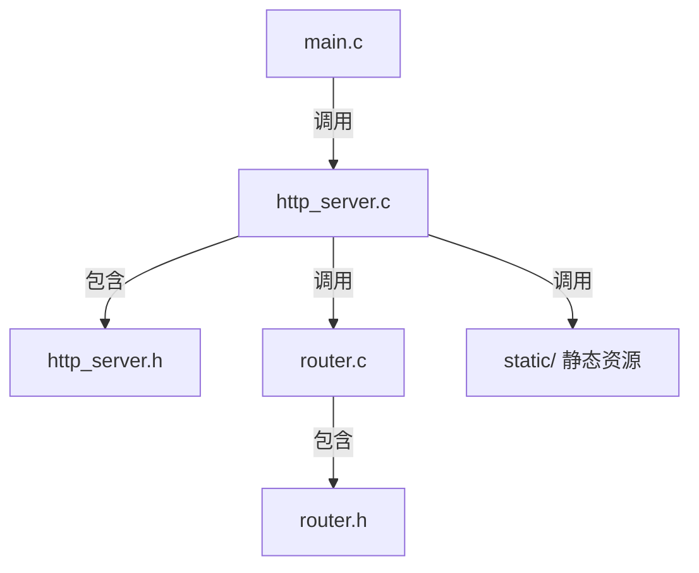

# 简易C语言HTTP服务器

## 项目简介
本项目是一个用C语言实现的最小可用HTTP服务器（MVP），支持多文件多目录结构，便于后续扩展。

## 目录结构
```
webserver/
├── include/         # 头文件目录
│   └── http_server.h
├── src/             # 源码目录
│   ├── main.c
│   ├── http_server.c
│   └── router.c
├── static/          # 静态资源目录
├── docs/            # 教程文档目录
│   └── tutorial.md
├── Makefile         # 构建脚本
└── README.md        # 项目说明
```

## 系统架构图



## 主要功能
- 支持自定义监听端口
- 支持GET / 和 /helloapi 路由
- 代码结构清晰，便于扩展

## 变量和函数跨文件引用说明
- 头文件（如`http_server.h`）用于声明函数和全局变量。
- 源文件（如`main.c`、`http_server.c`、`router.c`）通过`#include`包含头文件，实现跨文件调用。
- 例如，`main.c`调用`http_server.c`中的`start_server`函数，通过在`http_server.h`中声明该函数实现。
- `http_server.c` 通过 `#include "router.h"` 使用路由分发函数，避免了多重编译问题。

## 编译方法

1. 安装gcc（如MinGW）
2. 在webserver目录下执行：
   ```sh
   make
   ```
3. 生成可执行文件`webserver.exe`

## 运行方法

```sh
./webserver.exe 8080
```

8080为监听端口号，可自定义。

---

详细代码实现与教程见`docs/tutorial.md`。
